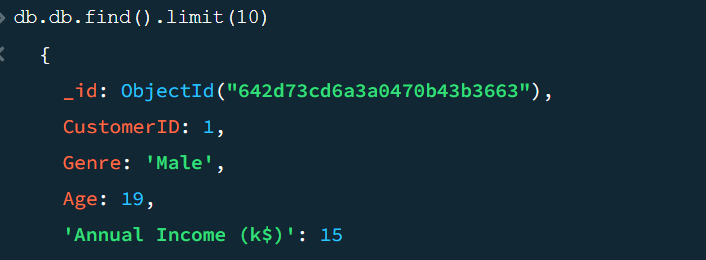
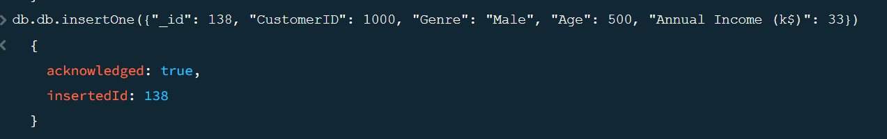
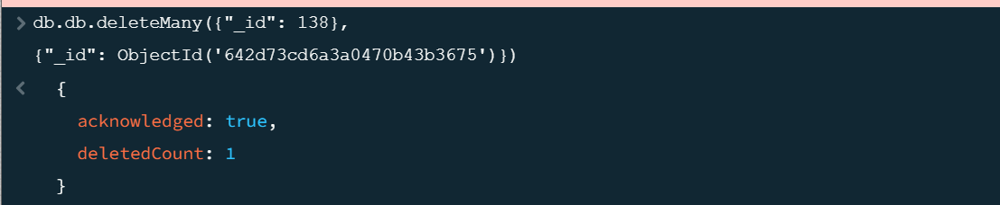
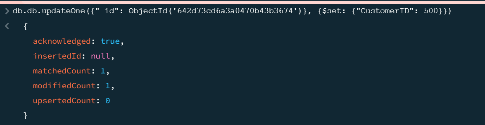
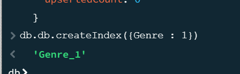
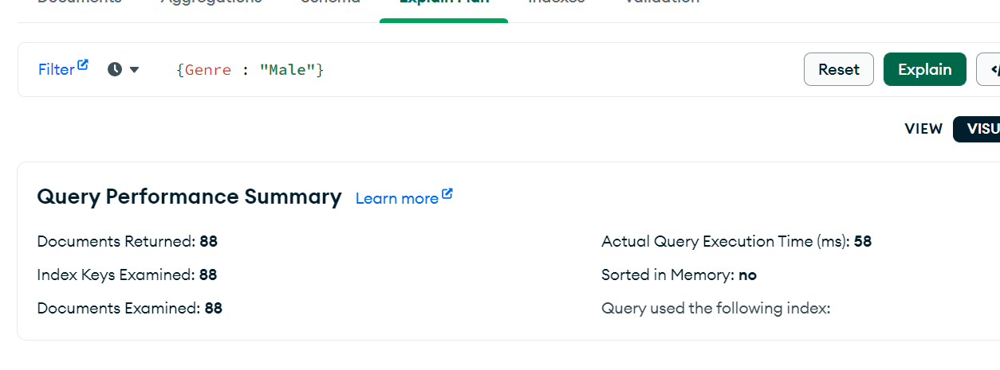
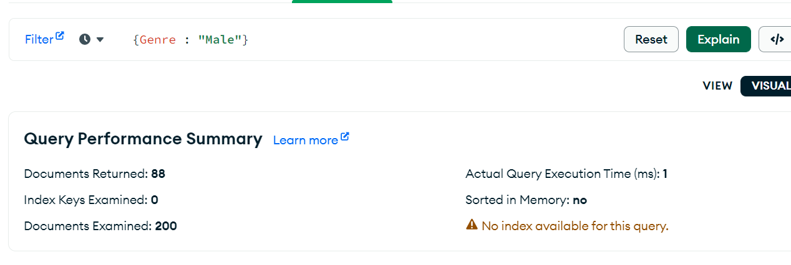

# DB
Here we have our DataBase

See how find works:

Then we insert information about a new customer:

Delete several non-actual clients:

Update information concerning our client:

Having created an index, see the difference in compilation

