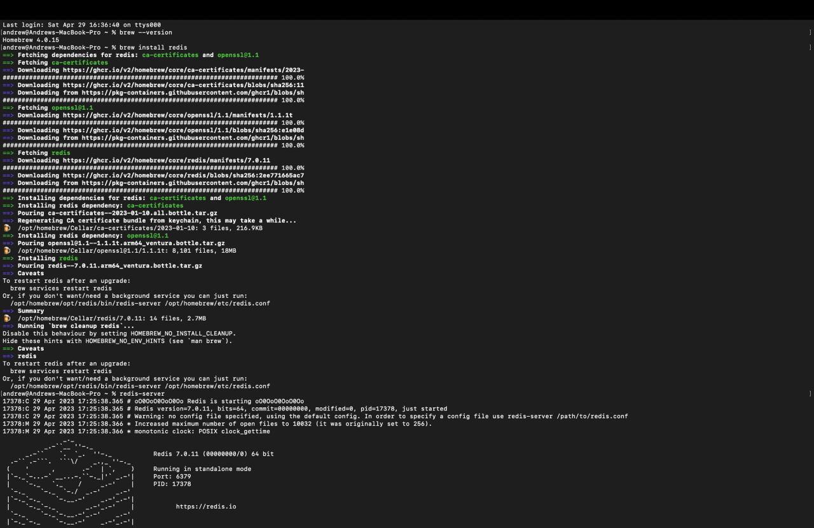
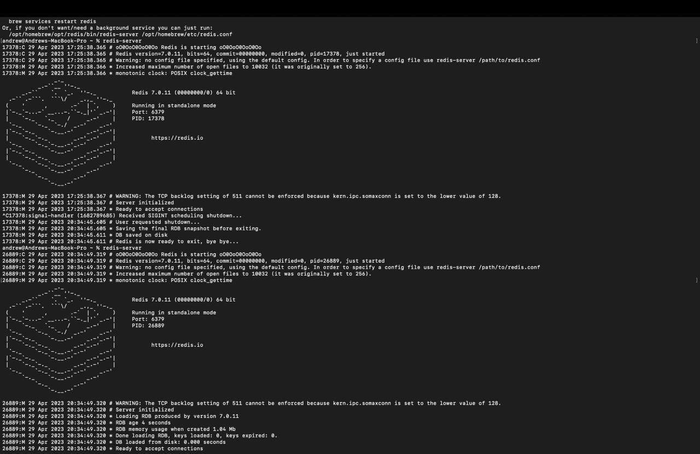
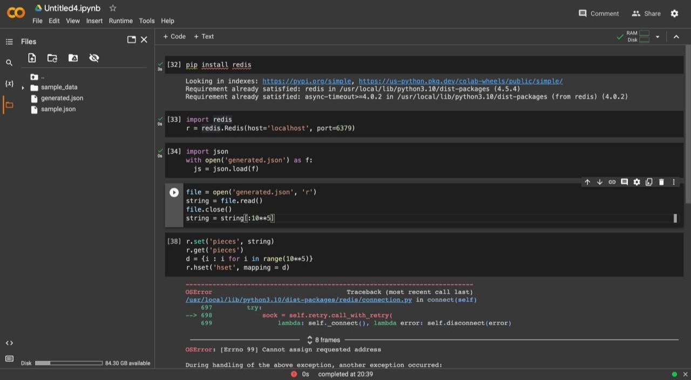
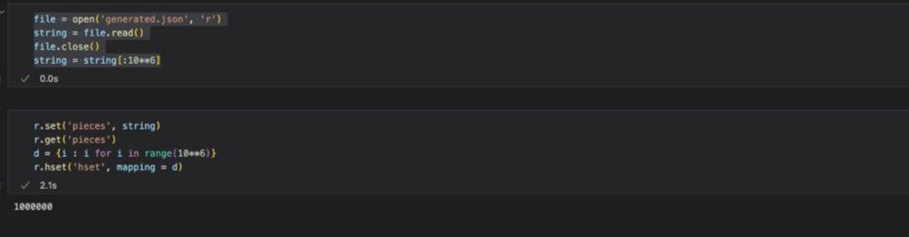
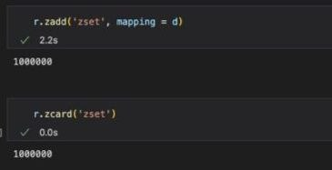
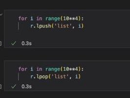
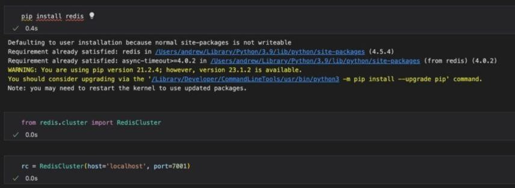
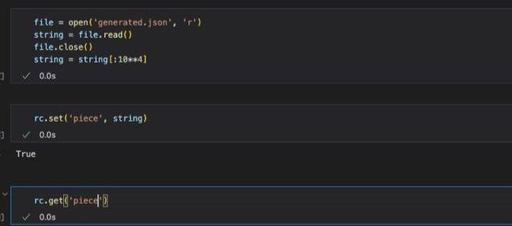
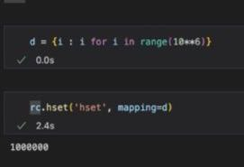

Подключаемся к Redis (после возникновения проблем с подключением через colab, перешел в VS Code)

С помощью команд set, hset, zcard и lpush разобьем исходный json на структуры строка, hset, zset, list
Сначала разобьем на строки и hset

Теперь на zset:

И наконец list:

Протестируем скорости сохранения и чтения
Для hset:

ыскуут3.jpg
Для zset:

Для list:

Настроим Redis Cluster на нодах:
Для этого создадим репозитории с файлами конфигурации в них и запустим их одновременно. После этого напишем следущий код:

По аналогии с Redis:

Пример работы команды:

